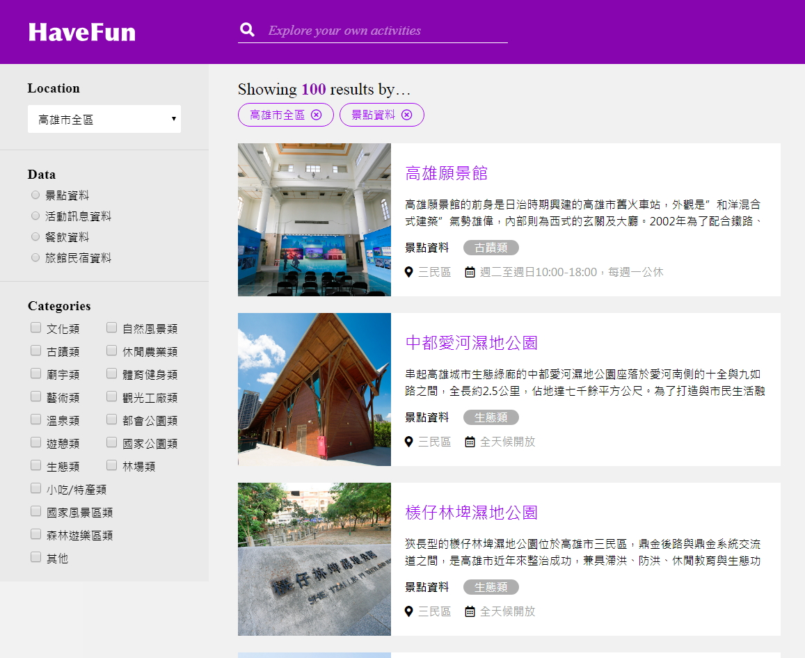

## 【練習作品】旅遊景點介紹
***
### 練習主題：版型練習、依資料產生內容
### 技術：html + CSS + jQuery + JSON資料 + DOM操作
### 頁面展示：<https://zshao1031.github.io/TheF2E-Week-2/>

### 資料來源：高雄市政府公開資料
### 未實作功能：篩選、搜尋功能

### 預覽圖片：

***
## 【其他說明】
### The F2E 活動：這是由《六角學院》所舉辦的練功活動，每週出一主題(附設計稿)給參加者練習，參與者可自行決定實作到什麼程度，但至少要挑一頁版型來製作。

### 設計稿：https://hexschool.github.io/THE_F2E_Design/week2-filter/?fbclid=IwAR1i_cV0Jeh9ujc-SdwVSAHxw81f_Zyl6eabbiKu2B57Zfcr6hh_mP337Og

